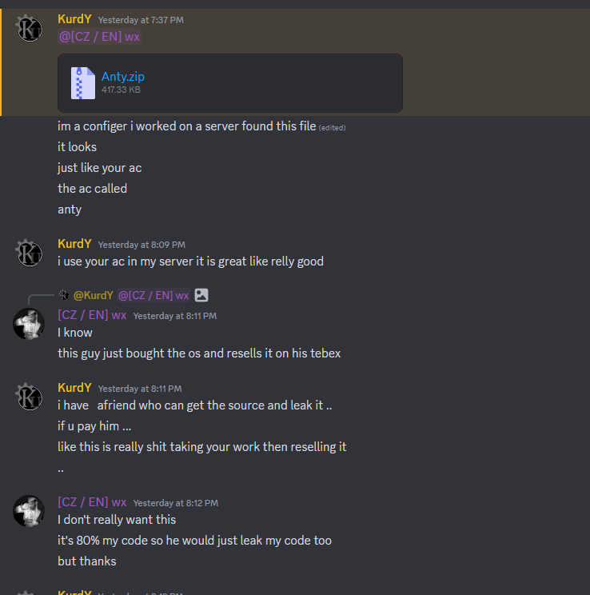

# Elfbar-Security - FiveM Anticheat ( Open Source Project )

Hello dear FiveM Community!
The Elfbar-Security Team (formerly ImoShield) has decided to make the panel and everything else open source so that everyone can use it.

Why did we decide to do this?
One of our former team members claims to have the source code and wants to leak and resell it, so you can download the source code here, officially from the owner of the code.
But note the licence below

## Some Panel Features
- Login & Register System with License Key
- Manage Server System ( Key Informations, Ac Logs, Banlist, Playerlist and more)
- Settings page ( Change Username, Mail, Password and more)
- Maintenance Mode System
- Panel Ban System
- Register & Login Logs
- Discord Webhook Logs
- Live Counter
- Admin Options ( Key, News and User Management, Logs and more)
- and much more!

## Anticheat Features
For the Anticheat Features you can check our Config-Panel by [clicking here](https://t.me/remoteapi)
If you want to use the anticheat without pasting, you must insert our Config Secret from our [Config Panel](https://t.me/remoteapi) into Config.lua, otherwise you will not be able to use the anticheat

## Some Customer Bot Features
- Clear Props / Vehicles / Peds / All Command
- Ban & Kick Command for the Anticheat
- Checkban Command to check ban IDs
- Reload Anticheat config Command
- Admin bypass via Discord Roles
- Restart FiveM Server Command
- Help Command with all Commands
- Unban Command to unban users from the Anticheat
- Logs System via Discord Channels
- and more!

## Backend System
To purchase the backend package (including a full panel, authentication system, etc., allowing you to fully create your own service), please reach out to me on Telegram at https://t.me/remoteapi ( Backend, Panel etc 50€ on Telegram )

## Contact 
Telegram: https://t.me/remoteapi

## Screenshots of our Project


## Support / need help with the Source code?

For support and help, join our [Discord Server](https://t.me/remoteapi) we will help you to Setup something if you want...

## Info
You have to write your own backend so that everything works properly. ( Panel: Banlist, Auth, Logs | Ac: Ban System, API and more )
We have not made our backend open source, because we dont want every skid Anticheat to have a panel & bot etc soon
If you are interested write to us, we might sell it on occasionally

### Kusinka's deleted ticket messages after asking him why he resells another anticheat.
> Context: Kusinka bought open source of [WX AntiCheat](https://anticheat.0wx.space/), which he then began to resell as his, replaced every string containing "WX" with "Anty" ('his' product) aswell as all logos, implemented 'his' (also skidded) licenensing system and began selling it on his tebex for 3x the price. He was so fucking stupid that he posted a showcase video where the detection screenshots were stolen from WX AntiCheat's discord. Few weeks later, he created a ticket on WX's discord server asking why he doesn't have access to the open source releases channel and started begging WX to send him the latest version because he's a customer. After providing him all the screenshots where he's reselling WX's product, he started saying shit like "it's not 1:1", "I only used some parts". After banning him, his friend joined the discord and started saying the same shit.
```
[24/12/2023 - 09:17] @kusinka (933043493746651236): <@1115986103988650035>
[24/12/2023 - 09:21] @kusinka (933043493746651236): no is use texture
[24/12/2023 - 09:21] @kusinka (933043493746651236): bcs ocr can take many ms
[24/12/2023 - 09:21] @kusinka (933043493746651236): but I really like seeing the way you work
[24/12/2023 - 09:22] @kusinka (933043493746651236): No
[24/12/2023 - 09:22] @kusinka (933043493746651236): you check
[24/12/2023 - 09:22] @kusinka (933043493746651236): can
[24/12/2023 - 09:22] @kusinka (933043493746651236): WTF
[24/12/2023 - 09:22] @kusinka (933043493746651236): no
[24/12/2023 - 09:22] @kusinka (933043493746651236): No
[24/12/2023 - 09:22] @kusinka (933043493746651236): where dis you put thus
[24/12/2023 - 09:23] @kusinka (933043493746651236): but that doesn't mean anything at all, I found it smart to put 5 hwid
[24/12/2023 - 09:24] @kusinka (933043493746651236): it's not the same at all lol, I have +200 execution
[24/12/2023 - 09:24] @kusinka (933043493746651236): I can detect eulen instant
[24/12/2023 - 09:24] @kusinka (933043493746651236): No
[24/12/2023 - 09:24] @kusinka (933043493746651236): Redengine instant
[24/12/2023 - 09:24] @kusinka (933043493746651236): hx
[24/12/2023 - 09:24] @kusinka (933043493746651236): tz
[24/12/2023 - 09:24] @kusinka (933043493746651236): Autofarm
[24/12/2023 - 09:24] @kusinka (933043493746651236): many featur
[24/12/2023 - 09:25] @kusinka (933043493746651236): because your code in part is also stolen
[24/12/2023 - 09:25] @kusinka (933043493746651236): that not anty this
[24/12/2023 - 09:26] @kusinka (933043493746651236): your ocr for exemple
[24/12/2023 - 09:26] @kusinka (933043493746651236): You need to test anty and see that it has nothing to do with it
[24/12/2023 - 09:27] @kusinka (933043493746651236): but you know it's not the same, that's why you didn't ban me
[24/12/2023 - 09:27] @kusinka (933043493746651236): i cant crack anty bs i use luraph
[24/12/2023 - 09:27] @kusinka (933043493746651236): and that NOT Wx
[24/12/2023 - 09:29] @kusinka (933043493746651236)
https://cdn.discordapp.com/attachments/1188410209371172905/1188413117101768755/IMG_5103.png?ex=659a6ef6&is=6587f9f6&hm=7b56556aa09054dcd86d4b186e2388b830183eb00acd1401f3cd6c77bd87a1d2&
[24/12/2023 - 09:29] @kusinka (933043493746651236): wdym
[24/12/2023 - 09:29] @kusinka (933043493746651236): i have a globan ban
[24/12/2023 - 09:30] @kusinka (933043493746651236): no
[24/12/2023 - 09:30] @kusinka (933043493746651236): Proof
[24/12/2023 - 09:30] @kusinka (933043493746651236): pls
[24/12/2023 - 09:30] @kusinka (933043493746651236): WTF
[24/12/2023 - 09:32] @kusinka (933043493746651236): it's not at all the same, you and I know that there is no resemblance. I just like the way you write your programs, I took your banning logic which seemed much more interesting to me but I can change and put in jsons if that bothers you
[24/12/2023 - 09:34] @kusinka (933043493746651236): and <@1115986103988650035>
[24/12/2023 - 09:34] @kusinka (933043493746651236): You overlay
[24/12/2023 - 09:35] @kusinka (933043493746651236): detection
[24/12/2023 - 09:35] @kusinka (933043493746651236): is not your detection that coresheild
[24/12/2023 - 09:35] @kusinka (933043493746651236): And many features
[24/12/2023 - 09:39] @kusinka (933043493746651236): <@1115986103988650035>
[24/12/2023 - 09:42] @kusinka (933043493746651236): always the same, you never provide proof of what you say. You listen to what you want to hear and this creates conflicts
```

**Kusinka's friend's ticket**
```
[24/12/2023 - 12:16] @b4l_remza (795377795365601291): THEY ARE THE SAME
[24/12/2023 - 12:16] @freezysek_ (968178343147085845): Bro xdddddd
[24/12/2023 - 12:16] @b4l_remza (795377795365601291): Stop talking Ur not a fivem développer your are leaker
[24/12/2023 - 12:16] KurdY#9244 (1128260338018689034): 😋
[24/12/2023 - 12:16] @b4l_remza (795377795365601291): Ok sur ??
[24/12/2023 - 12:16] @freezysek_ (968178343147085845): Just the fact that you have purchased open source wx anticheat shows that you are stealing xdd
[24/12/2023 - 12:16] @b4l_remza (795377795365601291): Bcd i have many proog
[24/12/2023 - 12:16] @b4l_remza (795377795365601291): Can i invite coresheild staff ??
[24/12/2023 - 12:17] @00wx (1115986103988650035): for what?
[24/12/2023 - 12:17] KurdY#9244 (1128260338018689034): core shield is ass..
[24/12/2023 - 12:17] KurdY#9244 (1128260338018689034): its leaked everywhere
[24/12/2023 - 12:17] @freezysek_ (968178343147085845): Yes
[24/12/2023 - 12:17] @freezysek_ (968178343147085845): But
[24/12/2023 - 12:17] @b4l_remza (795377795365601291): And why wx used m'y source
[24/12/2023 - 12:17] @00wx (1115986103988650035): coreshield has been proven many times to be built from free snippets on github
[24/12/2023 - 12:17] @freezysek_ (968178343147085845): Gonz is my friend
[24/12/2023 - 12:17] @freezysek_ (968178343147085845): <:takemylove:1153411479983366227>
[24/12/2023 - 12:17] @b4l_remza (795377795365601291): No
[24/12/2023 - 12:17] @b4l_remza (795377795365601291): Invite
[24/12/2023 - 12:18] @b4l_remza (795377795365601291): https://github.com/D3sTeptu/ocr-fivem
GitHub - D3sTeptu/ocr-fivem
Contribute to D3sTeptu/ocr-fivem development by creating an account on GitHub.
https://opengraph.githubassets.com/91c9f84c25d327c53bd8f65d8f51a4312740e16dec5bebf7ca11b1db5ba2b11b/D3sTeptu/ocr-fivem
[24/12/2023 - 12:18] @b4l_remza (795377795365601291): What did u use this ocr détection. ????
[24/12/2023 - 12:18] @b4l_remza (795377795365601291): Thzt thé same no ?
[24/12/2023 - 12:19] @00wx (1115986103988650035): what is you on dawg
[24/12/2023 - 12:19] @freezysek_ (968178343147085845): Bro is FREE
[24/12/2023 - 12:19] @b4l_remza (795377795365601291): Yeah
[24/12/2023 - 12:19] @b4l_remza (795377795365601291): But wx ressel
[24/12/2023 - 12:19] @b4l_remza (795377795365601291): Free functions
[24/12/2023 - 12:19] @00wx (1115986103988650035): you have the source code
[24/12/2023 - 12:19] @b4l_remza (795377795365601291): Thzt a fckg problème
[24/12/2023 - 12:19] @00wx (1115986103988650035): compare it
[24/12/2023 - 12:21] @b4l_remza (795377795365601291): Noo
[24/12/2023 - 12:21] @b4l_remza (795377795365601291): You are juste sell shit
[24/12/2023 - 12:21] @quizr1 (1076146281845637170): xd
[24/12/2023 - 12:21] @b4l_remza (795377795365601291): And destroy all m'y work and use m'y functions
[24/12/2023 - 12:22] @b4l_remza (795377795365601291): Im not a fucking kid bro
[24/12/2023 - 12:22] @b4l_remza (795377795365601291): I see u
[24/12/2023 - 12:22] KurdY#9244 (1128260338018689034): your functions arent even yours
[24/12/2023 - 12:22] @b4l_remza (795377795365601291): Bro anty Can detect instant redengune instant
[24/12/2023 - 12:22] @b4l_remza (795377795365601291): Try
[24/12/2023 - 12:22] @b4l_remza (795377795365601291): Te and many executor
[24/12/2023 - 12:22] @00wx (1115986103988650035): "your work"
[24/12/2023 - 12:22] KurdY#9244 (1128260338018689034): so do fivemn u cant currently use cheats
[24/12/2023 - 12:22] KurdY#9244 (1128260338018689034): because of the last update
[24/12/2023 - 12:22] KurdY#9244 (1128260338018689034): go try.
[24/12/2023 - 12:22] @b4l_remza (795377795365601291): No eulen
[24/12/2023 - 12:22] @b4l_remza (795377795365601291): Work
[24/12/2023 - 12:23] @b4l_remza (795377795365601291): Shit UP your are not développer
[24/12/2023 - 12:23] KurdY#9244 (1128260338018689034): not safe and eulen always was easy do detect
[24/12/2023 - 12:23] @freezysek_ (968178343147085845): You're kidding, right? literally wx was working on an anticheat for 4 months before release and it's still being modified, some noname anticheat of yours that 10 people are using and you have it released a month ago and you want to tell me I'm stealing it? You say that when you bought our open source
[24/12/2023 - 12:24] @b4l_remza (795377795365601291): All functions. Super jump was stolen
[24/12/2023 - 12:24] @freezysek_ (968178343147085845): you're an idiot
[24/12/2023 - 12:25] @freezysek_ (968178343147085845): BRO, YOU BOUGHT OUR ANTICHEAT, YOU STOLE IT, YOU UNDERSTAND?
[24/12/2023 - 12:25] @freezysek_ (968178343147085845): or why did you buy us ac?
[24/12/2023 - 12:25] @b4l_remza (795377795365601291): Nooooo
[24/12/2023 - 12:25] @b4l_remza (795377795365601291): Wx sell leak stuff
[24/12/2023 - 12:25] @b4l_remza (795377795365601291): I privé it
[24/12/2023 - 12:25] @b4l_remza (795377795365601291): Proove
[24/12/2023 - 12:26] @b4l_remza (795377795365601291): I buy ac 6 month ago
[24/12/2023 - 12:26] @b4l_remza (795377795365601291): Shit UP bro you Ask me in Time to leak
[24/12/2023 - 12:26] @b4l_remza (795377795365601291): 😭😭
[24/12/2023 - 12:26] @b4l_remza (795377795365601291): Xd
[24/12/2023 - 12:27] @freezysek_ (968178343147085845): stop
[24/12/2023 - 12:27] @freezysek_ (968178343147085845): writing shits
[24/12/2023 - 12:27] @b4l_remza (795377795365601291): No bro
[24/12/2023 - 12:27] @b4l_remza (795377795365601291): You sell shit
[24/12/2023 - 12:27] @freezysek_ (968178343147085845): bro
[24/12/2023 - 12:27] @freezysek_ (968178343147085845): nice idea
[24/12/2023 - 12:27] @b4l_remza (795377795365601291): Im sorry
[24/12/2023 - 12:27] @freezysek_ (968178343147085845): why
[24/12/2023 - 12:27] @freezysek_ (968178343147085845): buy us ac?
[24/12/2023 - 12:27] @b4l_remza (795377795365601291): Go to ticket
[24/12/2023 - 12:27] @b4l_remza (795377795365601291): I dont want to destroy chat and wx project
```
```
[24/12/2023 - 11:29] @b4l_remza (795377795365601291): You said shit i leak source  rn
[24/12/2023 - 11:29] @b4l_remza (795377795365601291): And
[24/12/2023 - 11:29] @b4l_remza (795377795365601291): All of pour fonctions was from coresheild
[24/12/2023 - 11:31] @b4l_remza (795377795365601291): And if you want you Can test license
[24/12/2023 - 11:31] @b4l_remza (795377795365601291): Lol anty detect almost executor
[24/12/2023 - 11:31] @00wx (1115986103988650035): who asked
[24/12/2023 - 11:31] @b4l_remza (795377795365601291): <@1115986103988650035> dm @kusinka
[24/12/2023 - 11:32] @00wx (1115986103988650035): nah
[24/12/2023 - 11:32] @b4l_remza (795377795365601291): Im a support from anty
[24/12/2023 - 11:32] @00wx (1115986103988650035): i dont give a single fuck
[24/12/2023 - 11:32] @b4l_remza (795377795365601291): And développer of coresheild
[24/12/2023 - 11:32] @b4l_remza (795377795365601291): You have
[24/12/2023 - 11:32] @00wx (1115986103988650035): you mean
[24/12/2023 - 11:32] @00wx (1115986103988650035): skidshield?
[24/12/2023 - 11:32] @b4l_remza (795377795365601291): My
[24/12/2023 - 11:32] @b4l_remza (795377795365601291): Ocerlay detection
[24/12/2023 - 11:32] @b4l_remza (795377795365601291): Now
[24/12/2023 - 11:32] @b4l_remza (795377795365601291): Im leakint with your all customer your source cod
[24/12/2023 - 11:33] @b4l_remza (795377795365601291): You use leak code
[24/12/2023 - 11:33] @00wx (1115986103988650035): the fuck you still saying? compare the two source codes then if mine is stolen
[24/12/2023 - 11:34] @b4l_remza (795377795365601291): Why did u sell leak fonctions and ressel ??
[24/12/2023 - 11:34] @00wx (1115986103988650035): ask the same question yourself
[24/12/2023 - 11:34] @b4l_remza (795377795365601291): Ocerlay detection IS your ??
[24/12/2023 - 11:34] @b4l_remza (795377795365601291): No no anty have Real détection not overlay
[24/12/2023 - 11:34] @00wx (1115986103988650035): who cares
[24/12/2023 - 11:34] @b4l_remza (795377795365601291): I use injection not overlay system lol
[24/12/2023 - 11:35] @00wx (1115986103988650035): i dont give a fuck bout some stolen code ac
[24/12/2023 - 11:35] @b4l_remza (795377795365601291): Bro
[24/12/2023 - 11:35] @b4l_remza (795377795365601291): Loll
[24/12/2023 - 11:35] @b4l_remza (795377795365601291): Your source
[24/12/2023 - 11:35] @00wx (1115986103988650035): stop yapping
[24/12/2023 - 11:35] @b4l_remza (795377795365601291): IS leak
[24/12/2023 - 11:35] @b4l_remza (795377795365601291): Abd
[24/12/2023 - 11:35] @00wx (1115986103988650035): who
[24/12/2023 - 11:35] @b4l_remza (795377795365601291): You sell shit
[24/12/2023 - 11:35] @00wx (1115986103988650035): find me the source
[24/12/2023 - 11:35] @b4l_remza (795377795365601291): Ok
[24/12/2023 - 11:35] @b4l_remza (795377795365601291): In 5 min
[24/12/2023 - 11:35] @b4l_remza (795377795365601291): I sens github link
[24/12/2023 - 11:35] @b4l_remza (795377795365601291): OK ???
[24/12/2023 - 11:35] @b4l_remza (795377795365601291): Bcd you sell shit
[24/12/2023 - 11:36] @00wx (1115986103988650035): so do you
[24/12/2023 - 11:37] @00wx (1115986103988650035): https://www.youtube.com/watch?v=wY7e-5Txb8w (coreshield source leak)
[24/12/2023 - 11:37] @00wx (1115986103988650035): how's this?
[24/12/2023 - 11:37] @00wx (1115986103988650035): <@968178343147085845>
[24/12/2023 - 11:42] @00wx (1115986103988650035): yk by leaking my source you're also leaking your ac since "anty" is 80% my source
[24/12/2023 - 11:45] @freezysek_ (968178343147085845): you're embarrassing, you don't know how to make your own code so you buy open source for 50e and then sell it as your own. xdddddddd
[24/12/2023 - 11:46] @freezysek_ (968178343147085845): you can't prove what we can do with your ac
[24/12/2023 - 11:46] @freezysek_ (968178343147085845): <@795377795365601291>
[24/12/2023 - 11:46] @freezysek_ (968178343147085845): <a:clown:1153411017313898587>
[24/12/2023 - 11:54] @b4l_remza (795377795365601291): Ok let me 1 moment pls
[24/12/2023 - 11:54] @b4l_remza (795377795365601291): I will show u
[24/12/2023 - 11:54] @b4l_remza (795377795365601291): Dont ban me rn
[24/12/2023 - 11:55] @freezysek_ (968178343147085845): <:takemylove:1153411479983366227>
[24/12/2023 - 12:07] @b4l_remza (795377795365601291): Lol exposes
[24/12/2023 - 12:07] @b4l_remza (795377795365601291): And
[24/12/2023 - 12:07] @b4l_remza (795377795365601291): You juste Say to chatgpt
[24/12/2023 - 12:07] @b4l_remza (795377795365601291): "édit this code"
[24/12/2023 - 12:07] @b4l_remza (795377795365601291): Rn
[24/12/2023 - 12:07] @00wx (1115986103988650035): how is this the same
[24/12/2023 - 12:07] @b4l_remza (795377795365601291): Itz christmas i will offert all of your source with your customer who buy escrowed
[24/12/2023 - 12:07] @b4l_remza (795377795365601291): Bcd
[24/12/2023 - 12:07] @b4l_remza (795377795365601291): U are scammer
[24/12/2023 - 12:08] @00wx (1115986103988650035): so what
[24/12/2023 - 12:08] @b4l_remza (795377795365601291): Open ticket
[24/12/2023 - 12:13] KurdY#9244 (1128260338018689034): u do know the seconde code u gave not the wx is from github?
[24/12/2023 - 12:13] @freezysek_ (968178343147085845): Bro
[24/12/2023 - 12:14] @freezysek_ (968178343147085845): You using stolen ac <@795377795365601291> xddd
[24/12/2023 - 12:14] KurdY#9244 (1128260338018689034): this code is from github
[24/12/2023 - 12:14] @b4l_remza (795377795365601291): Brooo
[24/12/2023 - 12:14] @b4l_remza (795377795365601291): Wx client have
[24/12/2023 - 12:14] @b4l_remza (795377795365601291): 1000 lines
[24/12/2023 - 12:14] KurdY#9244 (1128260338018689034): ok and?
[24/12/2023 - 12:14] @b4l_remza (795377795365601291): Anty have 3000 lines
[24/12/2023 - 12:14] KurdY#9244 (1128260338018689034): ok so
[24/12/2023 - 12:15] @00wx (1115986103988650035): so does wx
[24/12/2023 - 12:15] @b4l_remza (795377795365601291): Ok and ?? Wx used this leaksource
[24/12/2023 - 12:15] KurdY#9244 (1128260338018689034): its not in wx..
[24/12/2023 - 12:15] @b4l_remza (795377795365601291): You are juste dumb
[24/12/2023 - 12:15] @b4l_remza (795377795365601291): Bro thzt literraly thé same
[24/12/2023 - 12:15] @b4l_remza (795377795365601291): Juste hé delete eulen check
[24/12/2023 - 12:15] @b4l_remza (795377795365601291): And fonctions rename
[24/12/2023 - 12:15] @b4l_remza (795377795365601291): He Ask to chat gpt
[24/12/2023 - 12:15] @b4l_remza (795377795365601291): lOl
[24/12/2023 - 12:15] KurdY#9244 (1128260338018689034): bruh they arent the same
```


## License

[MIT License](https://github.com/flowzilla/Elfbar-Security-FiveM-Anticheat/blob/main/LICENSE)

Copyright (c) 2023-2024
Permission is hereby granted, free of charge, to any person obtaining a copy
of this software and associated documentation files (the "Software"), to deal
in the Software without restriction, including without limitation the rights
to use, copy, modify, merge, publish, distribute, sublicense, and/or sell
copies of the Software, and to permit persons to whom the Software is
furnished to do so, subject to the following conditions:

The above copyright notice and this permission notice shall be included in all
copies or substantial portions of the Software.

THE SOFTWARE IS PROVIDED "AS IS", WITHOUT WARRANTY OF ANY KIND, EXPRESS OR
IMPLIED, INCLUDING BUT NOT LIMITED TO THE WARRANTIES OF MERCHANTABILITY,
FITNESS FOR A PARTICULAR PURPOSE AND NONINFRINGEMENT. IN NO EVENT SHALL THE
AUTHORS OR COPYRIGHT HOLDERS BE LIABLE FOR ANY CLAIM, DAMAGES OR OTHER
LIABILITY, WHETHER IN AN ACTION OF CONTRACT, TORT OR OTHERWISE, ARISING FROM,
OUT OF OR IN CONNECTION WITH THE SOFTWARE OR THE USE OR OTHER DEALINGS IN THE
SOFTWARE.

## Authors / Creator

- [@remoteapi / V01D](https://www.github.com/flowzilla)
- [@remoteshell / H04X](https://www.github.com/H04X-Hoax)
